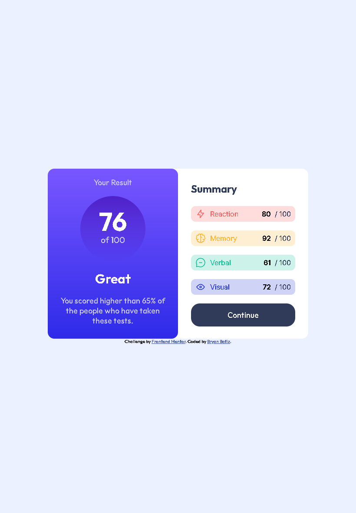

# Frontend Mentor - Results Summary Component Solution

This is a solution to the [Results Summary Component challenge on Frontend Mentor](https://www.frontendmentor.io/challenges/results-summary-component-CE_K6s0maV). Frontend Mentor challenges help you improve your coding skills by building realistic projects.

## Table of contents

- [Overview](#overview)
  - [The Challenge](#the-challenge)
  - [Screenshot](#screenshot)
  - [Links](#links)
- [My Process](#my-process)
  - [Built With](#built-with)
  - [What I Learned](#what-i-learned)
  - [Continued Development](#continued-development)
  - [Useful Resources](#useful-resources)
- [Author](#author)

---

## Overview

### The Challenge

Users should be able to:

- View the optimal layout for the interface depending on their device's screen size.
- See hover and focus states for all interactive elements.
- **Bonus**: Use the local JSON data to dynamically populate the summary section.

### Screenshot



### Links

- **Solution URL:** [Github](https://github.com/Rinzet/results-summary-component)
- **Live Site URL:** [GitHub pages](https://rinzet.github.io/results-summary-component/)

---

## My Process

### Built With

- Semantic HTML5
- SCSS with mixins and partials
- Flexbox
- Mobile-first design
- BEM-like class naming convention

### What I Learned

This challenge helped reinforce SCSS best practices, particularly:

- Creating and using mixins for font and responsive behavior:
  ```scss
  @mixin font($weight) {
    font-family: "Outfit", sans-serif;
    font-weight: $weight;
  }
  ```

- Building reusable layout logic:
  ```scss
  @mixin responsive-direction($direction-desktop, $direction-mobile) {
    @media (min-width: 769px) {
      flex-direction: $direction-desktop;
    }
    @media (max-width: 768px) {
      flex-direction: $direction-mobile;
    }
  }
  ```

- Organizing SCSS using partials like `_colors.scss` and `_mixins.scss`.

### Continued Development

I want to continue improving my:

- JS data-binding skills (e.g., dynamically rendering score data from JSON).
- Reusability of components in SCSS and maybe move toward utility-based styling (like Tailwind).
- Accessibility and semantic HTML practices.

### Useful Resources

- [Frontend Mentor Docs](https://www.frontendmentor.io/resources) – Useful for understanding requirements.
- [CSS Tricks - Flexbox Guide](https://css-tricks.com/snippets/css/a-guide-to-flexbox/) – Great for aligning and centering content.

---

## Author

- Frontend Mentor – [@Rinzet](https://www.frontendmentor.io/profile/Rinzet)